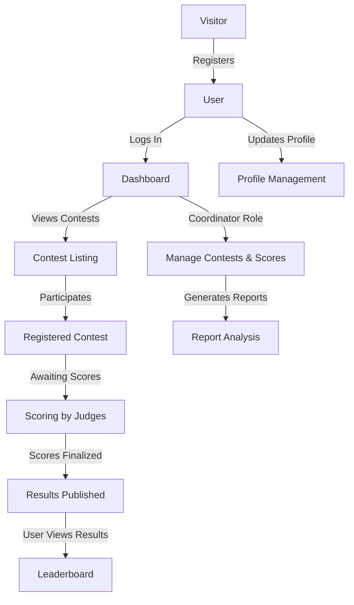

# 🏆 Contest Management System

## 🌍 Overview

The **Contest Management System** is a web-based application designed to facilitate contest organization, participation, and result management. Users can register, participate in various contests, and view results, while contest coordinators manage events, participant scores, and generate reports. The system ensures a seamless experience with dynamic form validations, AJAX-based data handling, and structured database operations.

### 👥 User Roles
- **Contest Coordinator**: Manages contest details, participant scores, and result generation.
- **Registered User**: Participates in contests and views results.
- **Visitor**: Views contest details and can register as a user.

---

## 📊 System Flowchart

Below is a high-level flowchart representing how users interact with the system:



This flowchart provides an overview of how users, coordinators, and the system interact in different stages.

---

## ⭐ Features

### 📝 Registration & Authentication
- Secure user registration with **client-side and server-side validations**.
- Unique email and mobile number verification.
- CAPTCHA verification using jQuery.
- Remember-me functionality and session management.
- Users will be automatically logged out after **5 minutes** of inactivity.

### 🎯 Contest Participation
- Users can browse and register for contests (e.g., Food Making, Photography).
- Contest registration is **restricted to two contests per month**.
- Real-time countdown for available contest participation.
- Auto-generated **four-digit random code** for additional contest registrations.
- Users can view their past contest participation of the last **one year**.

### ⚙️ Contest Management
- Add, edit, and manage contests dynamically.
- Display contest details using **stored procedures**.
- Validate contest registration dates before allowing participation.
- **Dynamic Control Generation** – Forms adjust based on contest requirements.
- Users can subscribe to receive contest notifications via **Email & SMS**.

### 🏅 Score Entry & Contest Results
- Judges can enter scores for each participant.
- Final scores and contest results are calculated and displayed.
- **Triggers automatically update winner count** in the database.
- Coordinators can assign scores for each contest.

### 📊 Reports & Data Analysis
- Contest coordinators can generate reports:
  - **Top 2 participants** with the highest win count.
  - **Top 10 cities** with maximum participants.
  - **Top 5 most popular contests**.
  - **Date-wise contest participation reports**.
- Data parsing using **JSON format conversion**.
- Contest trends represented using charts.

### 🖼 File Upload & Handling
- Users can upload **profile pictures** and **identity proofs** (Aadhar/Election card).
- Profile pictures: **JPEG, JPG, PNG (Max: 100KB)**.
- Identity proof: **PDF format (Max: 2MB)**.
- Prevents duplicate file names and handles errors effectively.
- Error handling for invalid formats and file sizes.

### 🔄 AJAX & Dynamic Features
- **Asynchronous data loading** for score entry.
- **Toggle effect for contest details**.
- **Loader display** while making AJAX requests.
- Alerts about new contests through AJAX popups.

---

## 📥 Installation Guide

### Step 1: Clone the Repository
```sh
git clone https://github.com/DarshanScripts/contest-management-system.git
```

### Step 2: Set Up the Database
1. Open **phpMyAdmin** (or any MySQL database manager).
2. Create a new database (e.g., `ContestManagementSystem`).
3. Copy the provided SQL file (`DatabaseSchema.sql`), paste into the SQL Panel & run it successfully.
4. Open `SQLConnection.php` and update the database credentials.

### Step 3: Run the Application
1. Move the project folder to `htdocs` (for XAMPP) or `www` (for WAMP/LAMP).
2. Start **Apache** and **MySQL** services.
3. Open a browser and go to:
   ```sh
   http://localhost/contest-management-system/
   ```

---

## 📂 Project Structure

```
contest-management-system/
│── Captcha.php                 # CAPTCHA implementation
│── CommonFunctions.php         # Reusable functions
│── ContestNotification.csv     # Stores subscription details
│── Footer.php                  # Footer for pages
│── JSON.php                    # JSON processing
│── Login.php                   # User login
│── Logout.php                  # User logout
│── Registration.php            # User registration
│── SQLConnection.php           # Database connection
│
├── Coordinator/                # Coordinator functionalities
│   ├── CoContestResult.php
│   ├── CoDashboard.php
│   ├── CoHeader.php
│   ├── CoLoadScoreEntry.php
│   ├── CoManageContest.php
│   ├── CoManageScoreEntry.php
│   ├── CoManageUser.php
│   ├── CoParticipationInfo.php
│   ├── CoReports.php
│
├── User/                       # User functionalities
│   ├── ThirdContest.php
│   ├── UserContest.php
│   ├── UserHeader.php
│   ├── UserHome.php
│   ├── UserParticipationHistory.php
│   ├── UserUpdateProfile.php
│   ├── getContestDetails.php
│
├── assets/                      # Assets folder
│   ├── Database/                # Database schema
│   │   ├── DatabaseSchema.sql
│   ├── fileUploadStuffs/        # Upload images and PDFs
│   ├── images/                  # Image assets
│   ├── js/                      # JavaScript files
```

---

## 💻 Technologies Used
- **PHP & MySQL** – Backend logic and database operations.
- **AJAX & jQuery** – Smooth data handling.
- **HTML, CSS, JavaScript** – Frontend development.
- **Bootstrap** – Responsive UI design.
- **JSON & APIs** – Data exchange.
- **Session & State Management** – Secure user authentication and auto-logout.

---

## 📜 License
This project is licensed under the **MIT License**.

---

## 👨‍💻 Author
Developed by **Darshan Shah**. Connect with me:

- **LinkedIn**: [Darshan Shah](https://www.linkedin.com/in/darshan-shah-tech/)
- **Facebook**: [DarshanScripts](https://www.facebook.com/DarshanScripts)
- **GitHub**: [DarshanScripts](https://github.com/DarshanScripts)
- **Quora**: [Darshan Shah](https://www.quora.com/profile/Darshan-Shah-1056)
- **Medium**: [DarshanScripts](https://medium.com/@DarshanScripts)
- **Fiverr**: [DarshanScripts](https://www.fiverr.com/darshanscripts)
